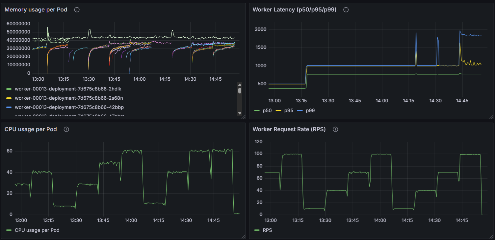
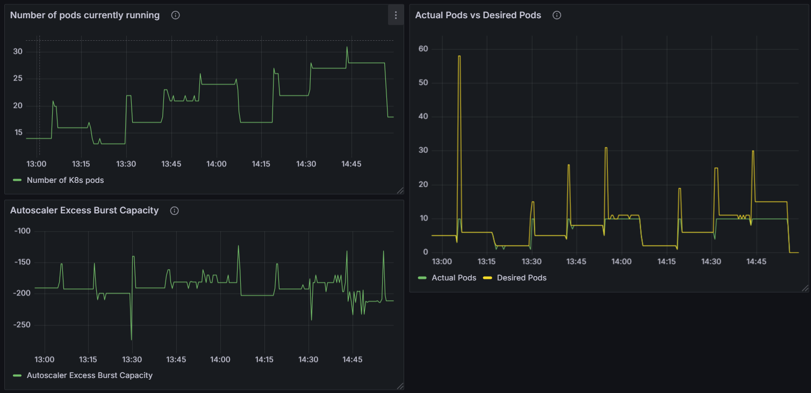

# 🚀 Performance metrics and Knative's autoscaling behavior analysis

This project analyzes **Knative’s autoscaling behavior (KPA)** under varying load conditions.
It sets up a distributed load-testing environment where a gRPC-based worker service is deployed on Knative, monitored via Prometheus and Grafana, and benchmarked using a custom load driver written in Go.

## 🧭 Directory Structure

```plaintext
performance-metrics-and-Knative-autoscaling-behavior-analysis/
│
├── client/                      # Load generator (load driver)
│   ├── Dockerfile
│   └── load_driver.go
│
├── server/                      # Worker service (Knative-deployed)
│   ├── Dockerfile
│   └── worker.go
│
├── deployment/                  # YAML manifests for deployment
│   ├── knative-autoscaler-servicemonitor.yaml
│   ├── knative-worker.yaml
│   ├── load-driver-job-template.yaml
│   ├── load-driver-job.yaml
│   ├── worker-metrics-service.yaml
│   └── worker-servicemonitor.yaml
│
├── proto/                       # gRPC definitions
│   ├── pb/
│   │   ├── load_worker.pb.go
│   │   └── load_worker_grpc.pb.go
│   └── load_worker.proto
│
├── scripts/                     # Experiment automation scripts
│   ├── build_and_push.sh
│   ├── collect_prometheus.sh
│   ├── deploy_all.sh
│   ├── port_forward.sh
│   ├── run_experiments.sh
│   └── worker.go
│
├── tools/
│   └── analyze_plot.py           # Post-experiment data analysis
│
├── assets/
├── go.mod
├── go.sum
├── Makefile
└── README.md
```


## 🧩 Setup Instructions

#### 1. Set Up a Two-Node Knative Cluster

Follow the vHive guide to set up a two-node Knative (stock-only) cluster on [CloudLab](https://www.cloudlab.us/):

📘 [vHive Quickstart Guide](https://github.com/vhive-serverless/vHive/blob/main/docs/quickstart_guide.md#iv-deploying-and-invoking-functions)

After provisioning the D430 nodes, install dependencies on both nodes:

```
sudo apt update
sudo apt install -y git make docker.io
sudo systemctl enable docker && sudo systemctl start docker
```

#### 2. Clone Repository (on Node 0)

```
git clone https://github.com/haiyen11231/performance-metrics-and-Knative-autoscaling-behavior-analysis.git
cd performance-metrics-and-Knative-autoscaling-behavior-analysis
```

#### 3. Install Helm and Monitoring Stack

- Install Helm

```
sudo apt-get install curl gpg apt-transport-https --yes
curl -fsSL https://packages.buildkite.com/helm-linux/helm-debian/gpgkey | gpg --dearmor | sudo tee /usr/share/keyrings/helm.gpg > /dev/null
echo "deb [signed-by=/usr/share/keyrings/helm.gpg] https://packages.buildkite.com/helm-linux/helm-debian/any/ any main" | sudo tee /etc/apt/sources.list.d/helm-stable-debian.list
sudo apt-get update && sudo apt-get install helm
```

- Add Helm Repositories for Prometheus and Grafana

```
helm repo add prometheus-community https://prometheus-community.github.io/helm-charts
helm repo add grafana https://grafana.github.io/helm-charts
helm repo update
```

- Install kube-prometheus-stack
  This automatically installs Prometheus, Alertmanager, Grafana, ServiceMonitors for comprehensive Kubernetes monitoring.

```
helm install monitoring prometheus-community/kube-prometheus-stack --namespace monitoring --create-namespace
```

- Verify installation:

```
kubectl get pods -n monitoring
```

#### 4. Access Dashboards (Prometheus & Grafana)

- Run port-forwarding inside Node 0:

```
./scripts/port_forward.sh
```

- Then, from your local machine, create an SSH tunnel:

```
ssh -L 3000:127.0.0.1:3000 haiyen@pc786.emulab.net
ssh -L 9090:127.0.0.1:9090 haiyen@pc786.emulab.net
or
ssh -L 3000:127.0.0.1:3000 -L 9090:127.0.0.1:9090 haiyen@pc786.emulab.net
```

Replace `haiyen@pc786.emulab.net` with `<username>@<external-ip-address>` of your node 0.

- Now open:
  Grafana: http://localhost:3000
  Prometheus: http://localhost:9090

- Retrieve Grafana credentials:

```
# Username
kubectl get secret monitoring-grafana -n monitoring -o jsonpath="{.data.admin-user}" | base64 --decode
# Password
kubectl get secret monitoring-grafana -n monitoring -o jsonpath="{.data.admin-password}" | base64 --decode
```

#### 5. Deploy the Experiment

- Temporarily remove the taint from the control-plane node to allow scheduling on node 0:

```
kubectl taint nodes node-000.haiyen-273246.ntu-cloud.emulab.net node-role.kubernetes.io/control-plane-
```

- Then deploy everything:

```
./scripts/deploy_all.sh
```

- Check running pods and logs:

```
kubectl get po
kubectl logs <load_driver_pod>
```

#### 6. Run Experiments

```
./scripts/run_experiments.sh
```

Results will be stored under `/results` and can be analyzed with `tools/analyze_plot.py`.

## 📊 Observing Metrics





## 🧠 Notes

- The Knative worker service is **cluster-local** (`networking.knative.dev/visibility: cluster-local`), so Prometheus must run **inside the same cluster** or be accessed via **SSH tunnel**.

- Use port forwarding (not NodePort) for secure dashboard access.

- All metrics are scraped by Prometheus using `ServiceMonitor` CRDs.

## 🔭 Future Work

- Evaluate **Knative HPA vs KPA** performance under different workloads.

- Integrate **OpenTelemetry (OTel)** for distributed tracing.

- Automate multi-RPS load sweeps and latency heatmaps.

## 📚 References

- [Helm Installation](https://helm.sh/docs/intro/install/)

- Prometheus Go Application Metrics:

  https://prometheus.io/docs/guides/go-application/

  https://grafana.com/docs/grafana-cloud/knowledge-graph/enable-prom-metrics-collection/application-frameworks/grpc/

  https://github.com/kubernetes/kube-state-metrics/blob/main/docs/metrics/workload/pod-metrics.md

  https://fatehaliaamir.medium.com/monitoring-grpc-services-in-golang-with-prometheus-9c15faec351f

- [Deploy Go application (REST) into Knative cluster](https://github.com/knative/docs/tree/main/code-samples/serving/hello-world/helloworld-go)

- Deploy Go application (gRPC) into Knative cluster:

  https://github.com/knative/docs/tree/main/code-samples/serving/grpc-ping-go

  https://www.alibabacloud.com/help/en/ack/ack-managed-and-ack-dedicated/user-guide/deploy-grpc-service-in-knative

  https://stackoverflow.com/questions/70272070/how-to-call-knative-service-grpc-server-by-using-a-python-client

  Notice port config `h2c`

- [Knative Serving code samples](https://knative.dev/docs/samples/serving/)

- [Getting number of K8s pods running in Prometheus](https://stackoverflow.com/questions/53595703/how-to-get-number-of-pods-running-in-prometheus)

- [Prometheus Go Application Metrics with NodePort](https://medium.com/@muppedaanvesh/a-hands-on-guide-to-kubernetes-monitoring-using-prometheus-grafana-%EF%B8%8F-b0e00b1ae039)

- [Important metrics in Grafana](https://grafana.com/docs/grafana-cloud/knowledge-graph/enable-prom-metrics-collection/application-frameworks/grpc/)

- [Kubernetes Pod Metrics](https://github.com/kubernetes/kube-state-metrics/blob/main/docs/metrics/workload/pod-metrics.md)
